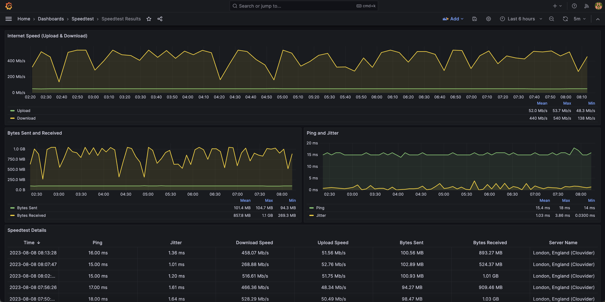

# Speeder

Python script to monitor your internet speed! 🚀

Periodically run [librespeed/speedtest-cli](https://github.com/librespeed/speedtest-cli) and send results to [InfluxDB](https://www.influxdata.com/products/influxdb/).

# Quick Start

> **Note**
> The assumption is made that you've already setup `InfluxDB 2.x.x`. Alternatively, you can use the [Docker Compose](#docker-compose-stack---influxdb-and-grafana) method where this is setup for you.

List available server IDs:

```bash
docker run --rm -it ghcr.io/dbrennand/speeder:1.1.0 /librespeed --list
```

Next, start and configure speeder using the environment variables:

```bash
docker run -itd --rm --name speeder \
    -e "SPEEDER_SPEEDTEST_INTERVAL=300" \
    -e "SPEEDER_SPEEDTEST_SERVER_ID=49" \
    -e "SPEEDER_INFLUXDB_HOST=influx.example.com" \
    -e "SPEEDER_INFLUXDB_TOKEN=<Token>" \
    -e "SPEEDER_INFLUXDB_ORG=speeder" \
    -e "SPEEDER_INFLUXDB_BUCKET=speeder" \
    ghcr.io/dbrennand/speeder:1.1.0
```

# Environment Variables

The [speeder](speeder.py) script is configured using the below environment variables:

| Name                          | Description                                                                                | Default Value |
| ----------------------------- | ------------------------------------------------------------------------------------------ | ------------- |
| `SPEEDER_SPEEDTEST_INTERVAL`  | Interval in seconds to run speedtests on.                                                  | 300           |
| `SPEEDER_SPEEDTEST_SERVER_ID` | Server ID to run speedtests against. Supports multiple IDs using a comma separated string. | ""            |
| `SPEEDER_INFLUXDB_HOST`       | InfluxDB hostname.                                                                         | influxdb      |
| `SPEEDER_INFLUXDB_PORT`       | InfluxDB port.                                                                             | 8086          |
| `SPEEDER_INFLUXDB_TOKEN`      | InfluxDB token.                                                                            | root          |
| `SPEEDER_INFLUXDB_ORG`        | InfluxDB organisation name.                                                                | speeder       |
| `SPEEDER_INFLUXDB_BUCKET`     | InfluxDB bucket name to write speedtest results to.                                        | speeder       |

# Docker Compose Stack - InfluxDB and Grafana

The [docker-compose.yml](docker-compose.yml) file in this repository will deploy speeder, InfluxDB and Grafana containers. Grafana will be provisioned with InfluxDB as the [data source](grafana-config/datasources/datasource.yml) and the pre-created [dashboard](grafana-config/dashboards/dashboard.json):



1. Set the `SPEEDER_SPEEDTEST_SERVER_ID` environment variable located in the [.env](.env) file to the server ID to perform speedtests against.

    > **Note**
    >
    > If you don't know any server IDs, run the following command to list them:
    > ```bash
    > docker run --rm -it ghcr.io/dbrennand/speeder:1.1.0 /librespeed --list
    > ```

2. Set the `DOCKER_INFLUXDB_INIT_PASSWORD`, `DOCKER_INFLUXDB_INIT_ADMIN_TOKEN` and `GF_SECURITY_ADMIN_PASSWORD` environment variables located in the [.env](.env) file.

3. Start the compose stack:

    ```bash
    docker compose up -d
    ```

Grafana will be accessible at [`http://localhost:3000`](http://localhost:3000) and your host's IP address.

## Disclaimer

I did **NOT** create the LibreSpeed project or CLI. The great folks over at [LibreSpeed](https://github.com/librespeed) did.

If you like this project then please give their repositories a star! ⭐

## Authors -- Contributors

[**Daniel Brennand**](https://github.com/dbrennand) - *Author*

## License

This project is licensed under the MIT License - see the [LICENSE](LICENSE) for details.
